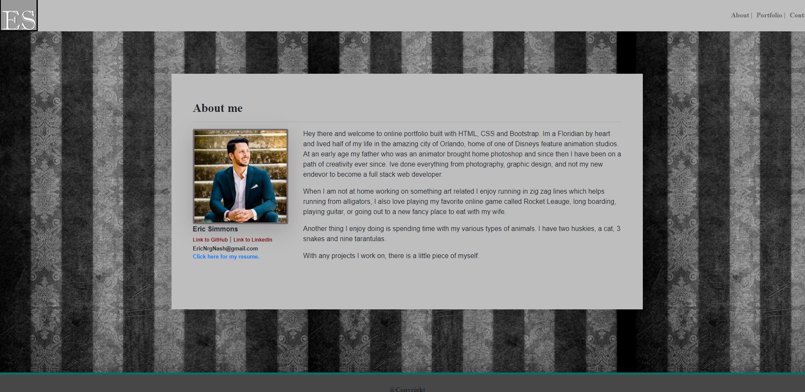
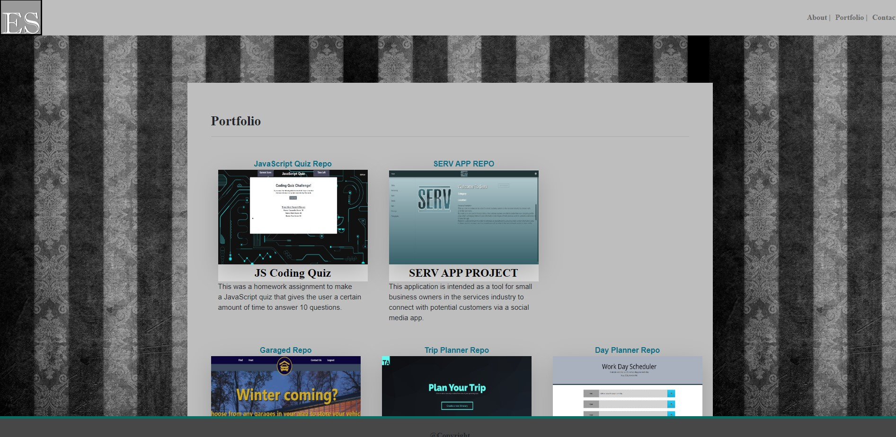
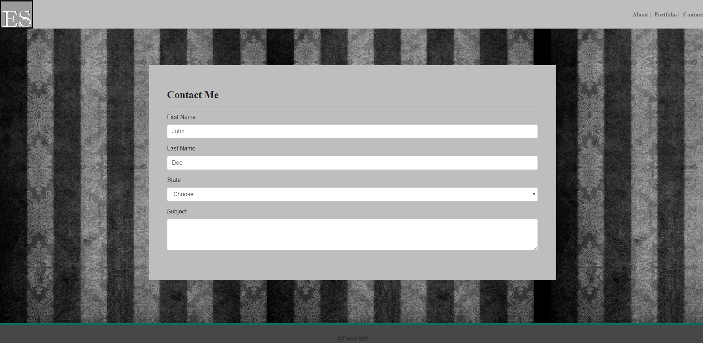

# Homework (Portfolio using Boostrap)
Version 2.0

## Contributors
@ericenergy

## Technology
- HTML5, CSS, SCSS
- Bootstrap
- Javascript (via Bootstrap)

## About
- THis portfolio is an example website made for a homework assignment for Vanderbilt Bootcamp Class. It's my Basic-Portfolio completely rebuilt from the ground-up using HTML and Bootstrap/CSS This makes it far more responsive and easily read on smaller viewports. 

## How this Works

- The home screen will be able to see a brief about me as well as my contact info and a link to see and download my resume.

- Here you will see the current projects and apps I have worked on with brief descritions. You are able to click on the links above the descriptions which will take you to the depolyed apps.

- Here you can fill out the form to contact me.

## License
- Open-source, Unlicense

## Contribution Guidelines
  This was built for a homework assignment and as such will likely not be edited later, but comments, critique, and suggestions are always welcome, for use in future work!
  
## Contact

- e-mail: ericnrgnash@gmail.com
- LinkedIn: https://www.linkedin.com/in/eric-simmons-8364b25b/
